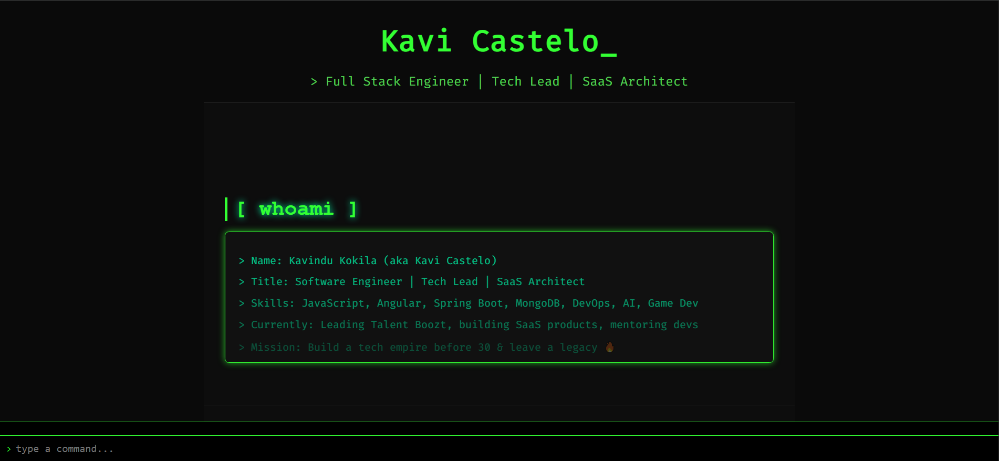

# 🖥️ Hacker-Themed Console Portfolio

A retro-inspired, command-line-style developer portfolio built with pure HTML, CSS, and JavaScript (no frameworks!). Designed to give visitors a unique, interactive terminal experience while showcasing projects, blogs, and professional details.

 <!-- optional preview image -->

## 🚀 Features

- 💻 Terminal-style UI with command parser
- 🧠 Dynamic command aliases (`about`, `read blog`, `open project`, etc.)
- 📂 Modular data structure for blogs and projects
- 🌐 SEO-friendly dynamic blog and project view pages
- 🎯 Slug-based routing and redirection
- 📱 Responsive layout with dark theme
- ⚙️ Extendable with real contact forms, analytics, or backend

## 📁 Project Structure

```text
├── index.html # Main console UI
└── blogs/
  └── view.html # Blog view page (slug based)
  └── styles.css
  └── main.js
└── projects/
  └── view.html # Project view page (slug based)
  └── styles.css
  └── main.js
└── css/
  └── styles.css # Console UI styles
└── js/
  └── utils/
    ├── blogsData.js # Blog metadata and content
    └── projectsData.js # Project metadata and content
  ├── main.js # Main content script
  ├── animation.js # Animation logic
  └── terminal.js # Command parser and logic
└── assets/ # Images, icons, etc.
```

## ⚡ Available Commands

| Command               | Shortcut    | Description                    |
|-----------------------|-------------|--------------------------------|
| `help`                | `ls`        | View available commands        |
| `about`               | `a`         | Learn about the developer      |
| `projects`            | `p`         | Navigate to `Projects` section |
| `blogs`               | `b`         | Navigate to `Blogs` section    |
| `contact`             | `c`         | Navigate to `Contact` section  |
| `whoami`              | `who`       | View developer details         |
| `ls blogs`            | `ls b`      | List all available blogs       |
| `read blog <slug>`    | `rb <slug>` | Open a blog article by slug    |
| `ls projects`         | `ls p`      | List all projects              |
| `view project <slug>` | `vp <slug>` | Open a project detail page     |
| `sudo`                | -           | Administrator                  |
| `fortune`             | `f`         | Random quote                   |
| `clear`               | `cls`       | Clear the console              |

> Slugs are automatically listed when you run `ls blogs` or `ls projects`.

## 🧠 How It Works

- All blog/project content is stored in utility JS files (`blogsData.js`, `projectsData.js`)
- `view.html` pages dynamically load content based on the URL's `?slug=...` param
- SEO meta tags are updated on runtime for better indexing and shareability

## 🛠️ Setup

Clone this repository and open `index.html` directly in your browser:

```bash
git clone https://github.com/kavicastelo/kavicastelo.io.git
cd kavicastelo.io
open index.html
```

Or deploy via [Netlify](https://www.netlify.com/), [Vercel](https://vercel.com/), or [GitHub Pages](https://pages.github.com/).

## 🧪 Live Demo

🔗 Visit [Live Portfolio](https://kavicastelo.github.io/kavicastelo.io/)

## 🙏 Credits
This project was designed and built by [Kavi Castelo (Kavindu Kokila)](https://github.com/kavicastelo), inspired by hacker aesthetics and minimalism.

## 📄 License
MIT License – use freely, but give credit where due.
